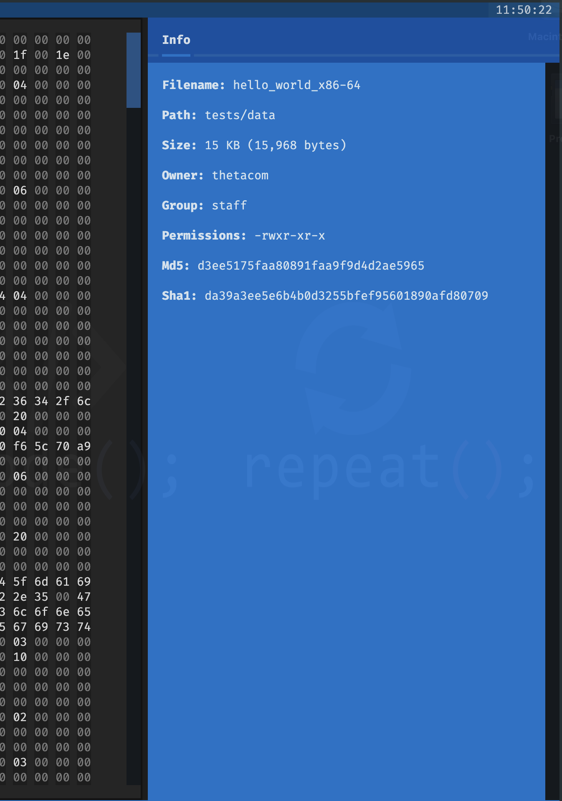
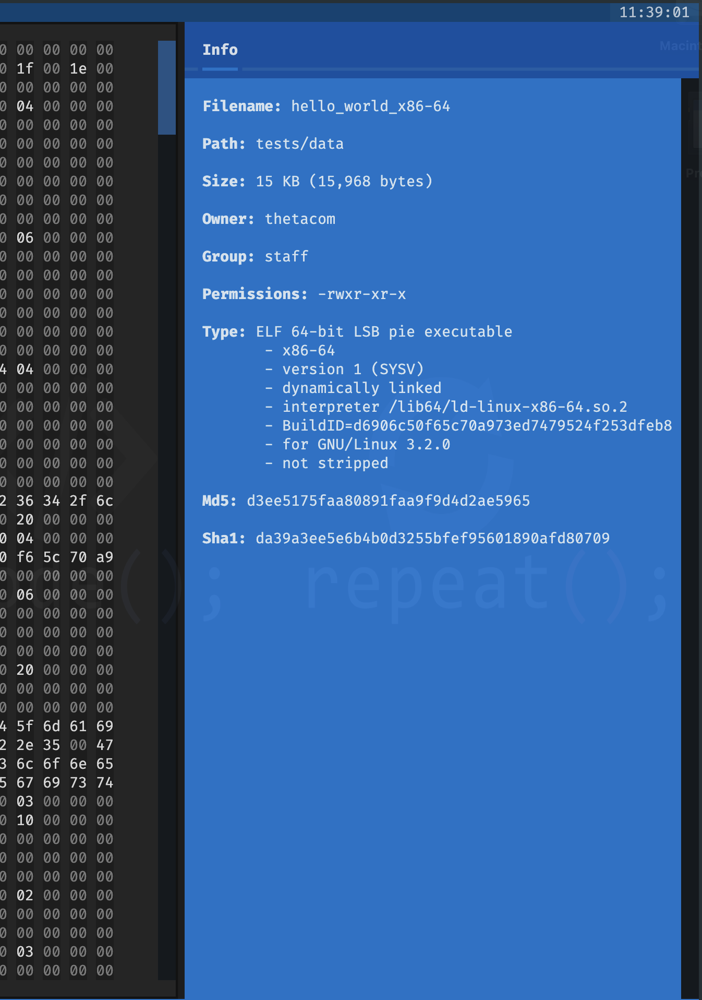
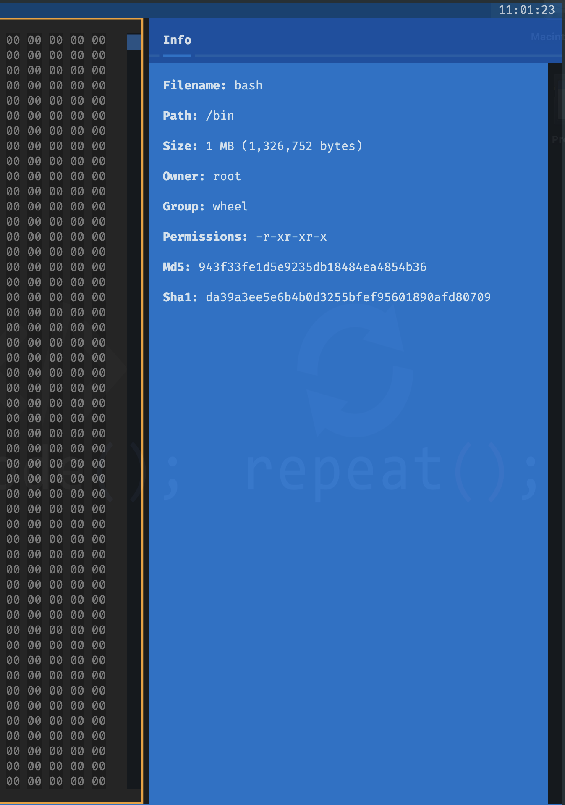
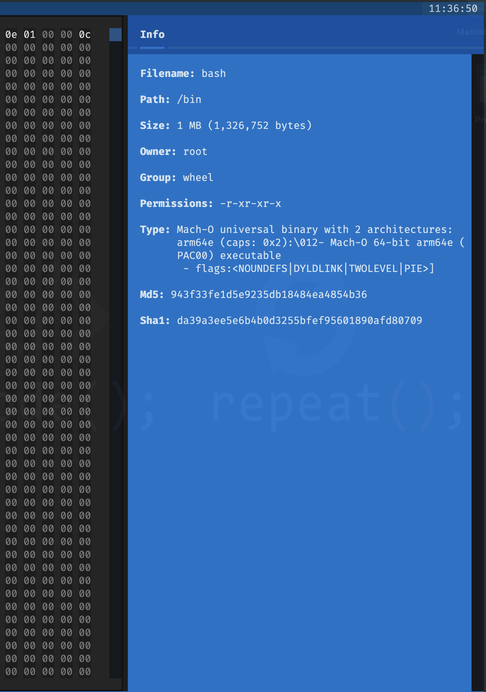

# Hexabyte Extended Info Plugin

[](https://pypi.python.org/pypi/hexabyte_extended_info)
[](https://pypi.python.org/pypi/hexabyte_extended_info)
[](https://pypi.org/project/hexabyte_extended_info/)
[](https://pypi.python.org/pypi/hexabyte_extended_info)
[](https://pypi.python.org/pypi/hexabyte_extended_info)
[](https://pypi.org/project/hexabyte_extended_info/)
[](https://pypi.org/project/hexabyte_extended_info/)

[](https://github.com/thetacom/hexabyte_extended_info/actions/)
[](https://github.com/thetacom/hexabyte_extended_info/actions/)
[](https://github.com/thetacom/hexabyte_extended_info/actions/)
[](https://github.com/thetacom/hexabyte_extended_info/actions/)

[](https://github.com/pre-commit/pre-commit)
[](https://github.com/charliermarsh/ruff)

A hexabyte plugin for displaying additional file info.

This plugin uses the [python-magic](https://github.com/ahupp/python-magic) package to provide robust file type details when possible.

## User

### Install

```bash
~/$ pip install hexabyte-extended-info
...
```

Add `hexabyte_extended_info` to the plugins list inside your hexabyte config (`~/.config/hexabyte/config.toml`).

```toml
plugins = [ "hexabyte_extended_info",]
```

## x86_64 Hello World

Standard Info Panel



Extended Info Panel



## MacOS Bash

Standard Info Panel



Extended Info Panel



## Developer

```bash
~/$ git clone https://github.com/thetacom/hexabyte_extended_info
...
~/$ cd hexabyte
hexabyte_extended_info/$ poetry install
...
```

### Test

```bash
hexabyte_extended_info/$ make test
...
```
